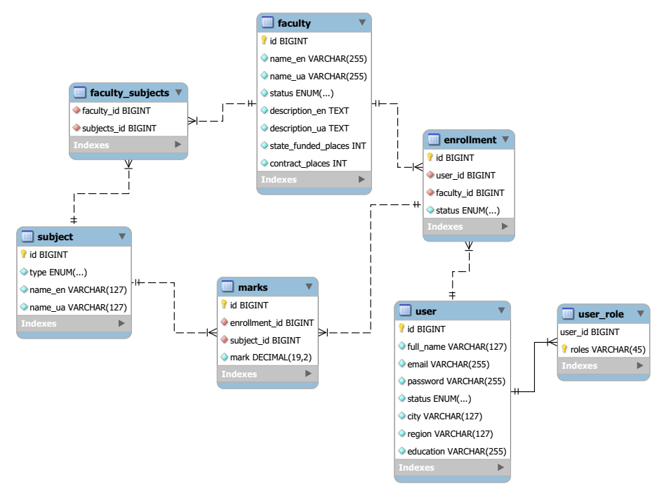

## University Admission

### Task
The system has a list of faculties that can be sorted by various criteria:
 * by name (a-z, z-a);
 * by number of state funded places;
 * by total number of places.
 
Entrant is registered in the system. During registration it is necessary for him to enter full name, email, city,
  region, name of educational institution.

Entrant can register for one or more faculties. When registering at
  faculty he enters marks for relevant subjects, as well as grades from the certificate.
  
The system administrator can:
- add, delete or edit faculty;
- block or unlock entrant;
- add entrant results to final list;
- finalize enrollments information.
  
After finalization, system calculates total points and determines entrants enrolled
  to the educational institution on state funded and contract places. 

### Database diagram of developed web-application:

